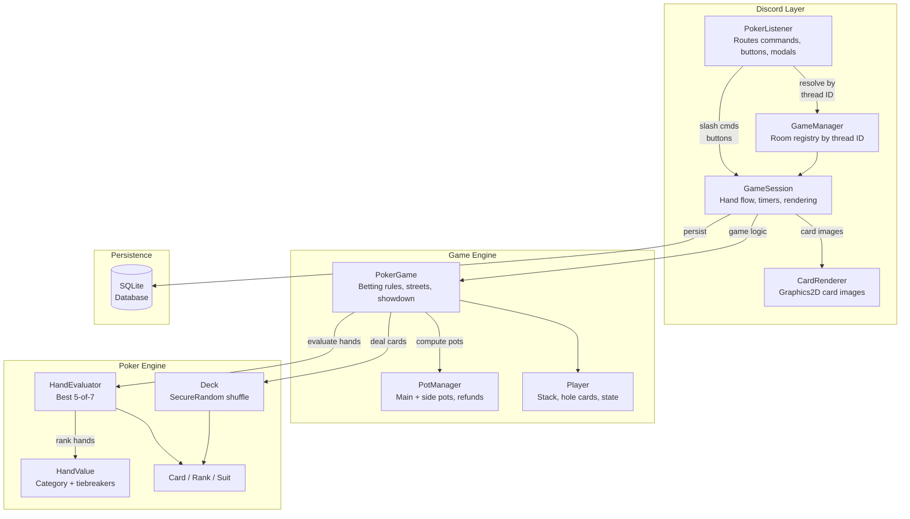

# Java-Final — Discord Poker Bot 🃏

A **No-Limit Texas Hold'em** bot for Discord, written in Java (JDA 5) with a
SQLite database. Each table runs in its own **private thread**; public game state
is posted in the thread, and every player sees only their own hole cards via
**ephemeral** messages.

---

## Features

- Owner opens a room and sets **buy-in, small blind and big blind** (locked once the game starts).
- **Multiple rooms per channel** — each game gets its own private thread named `game-<8-char-id>` (max 3 open rooms per owner, **2–10 players** per table).
- Players join a lobby, owner starts → **seats are randomized**.
- Full hand loop: blinds → deal hole cards → pre-flop / flop / turn / river betting → showdown → payout → cleanup → next hand.
- **Dead button rule** (TDA rule 32): the **big blind advances exactly one live player** per hand — nobody is skipped for it and nobody pays it twice in a row. If the big-blind player busts, the next hand has a **dead small blind** (nobody posts it); if the small blind busts, the **button stays put for one hand** (dead button). Heads-up the non-BB player is button + small blind (TDA 34-B).
- Correct **No-Limit betting rules**: bet ≥ 1 BB or all-in, proper **min-raise** — including over **short all-in opening bets** (a raise must add at least one full bet, and a big raise over a short bet sets the true min re-raise), the **incomplete all-in raise** rule (a short all-in does not re-open the betting for players who already acted — Raise/All-in buttons are hidden when betting is closed), and **cumulative short all-ins** that total a full raise re-opening the betting (TDA 47-A).
- **Turn lock**: only the player to act can act; anyone else is rejected.
- **Side pots** computed automatically for any number of all-ins, with **uncalled bets refunded**. Odd chips go to the first seat left of the dealer button.
- **Card images** rendered via Graphics2D (headless) — board cards, hole cards, and card backs displayed as PNG attachments.
- **Winner's best five highlighted** at showdown with yellow-bordered board cards.
- **Inline table state** with every turn prompt — no more scrolling up to see the board:
  ```
  Hand #3   Flop
  Board: 7♣ 5♥ A♠
  Pot: 120    Blinds: 10/20
  --------------------------------------
   D Rogue            stack:940     bet:0      check
  >  nimamas          stack:960     bet:0
     pwn2ooown        stack:940     bet:0      call 20
  --------------------------------------
  To act: nimamas  Min bet: 20
  ```
- **Last action shown inline** next to each player in the table (check, call 20, raise 100, fold, etc.).
- **30-second timer** per turn with a **~10s reminder ping**: 1st timeout = **auto-check** (if no bet) or **auto-fold** (if facing a bet) with warning; a **2nd *consecutive* timeout = kicked**.
- **Show cards after hand** — 10-second window with buttons to publicly reveal one or both hole cards; the buttons **expire** when the window closes.
- **View my cards** button on every turn prompt — privately shows your hole cards + current best hand with card image.
- **Action buttons** with silent acknowledgment (no confirmation popup cluttering the chat); slash-command actions get a small private confirmation instead.
- **Stale-click protection** — every action button and the raise dialog are bound to the prompt they belong to; a leftover button from an earlier turn is rejected instead of betting at a price you never saw.
- Quit any time (auto-folds the current hand, no longer dealt in), join any time (seated next hand). **Busted players** are removed once the room is waiting and can re-join for a **fresh buy-in**.
- If the **owner leaves/is kicked**, the next player by join order becomes owner — including mid-hand and when joining an owner-less room.
- At least **2 players** required to start.
- **Showdown reveals every remaining player's cards.**
- Game state, players, stacks and a hand history are persisted to **SQLite** (WAL mode, transactional per hand).
- Owner can `end` (stop after the current hand) or `forceend` (stop immediately — the unfinished hand is **cancelled and all bets returned**).
- **SecureRandom** used for card and seat shuffling (cryptographic fairness).
- Input validation: buy-in/blind/bet capped at 10M to prevent overflow.
- Display names sanitized in code blocks (formatting, control and RTL-override characters stripped).

---

## Architecture



---

## Requirements

- **Java 17+** (developed and tested on Java 21)
- **Maven 3.8+**

---

## 1. Get a Discord Bot Token

1. Open the **Discord Developer Portal**: <https://discord.com/developers/applications>
2. Click **New Application**, give it a name (e.g. `PokerBot`), and create it.
3. In the left sidebar open the **Bot** tab.
4. Click **Reset Token** (or **Add Bot** → **Yes, do it**), then **Copy** the token.
   This long string is your `DISCORD_TOKEN`. **Treat it like a password — never commit it.**
5. **Privileged Gateway Intents:** this bot needs **none** of them. You can leave
   *Presence*, *Server Members* and *Message Content* **OFF**.

### Invite the bot to your server

1. Go to the **OAuth2 → URL Generator** tab.
2. Under **Scopes**, check **`bot`** and **`applications.commands`**.
3. Under **Bot Permissions**, check:
   - Send Messages
   - Attach Files
   - Embed Links
   - Read Message History
   - **Create Private Threads**
   - **Send Messages in Threads**
   - **Manage Threads** (needed to add/remove members and clean up messages)
   - Manage Messages
   - Use Application Commands
4. Copy the generated URL at the bottom, open it in your browser, pick your server and **Authorize**.

### (Optional) Get your Server ID for instant commands

Global slash commands can take up to ~1 hour to appear. To make them show up
**instantly during development**, register them to a single server:

1. In Discord: **User Settings → Advanced → enable Developer Mode**.
2. Right-click your server icon → **Copy Server ID**.
3. Put it in `.env` as `GUILD_ID` (see below).

---

## 2. Configure `.env`

Copy the example file and paste in your token:

```bash
cp .env.example .env
```

Then edit `.env`:

```ini
DISCORD_TOKEN=paste-your-token-here
GUILD_ID=                # optional: a server ID for instant slash-command updates
DB_PATH=poker.db         # optional: SQLite file path (default poker.db)
```

`.env` and `*.db` are already in `.gitignore`, so your secret and database stay local.

---

## 3. Build & Run

```bash
# Run the tests (pure poker engine: hand ranking, side pots, betting rules)
mvn test

# Build a single runnable jar
mvn -DskipTests package

# Run it
java -jar target/poker-bot.jar
```

When you see `Poker bot is ready.` the bot is online.

---

## 4. How to Play

All commands are **slash commands**. Convenient **buttons** appear during play, but
everything also has a slash-command equivalent.

| Command | Who | Where | What it does |
|---|---|---|---|
| `/poker open buyin:<n> sb:<n> bb:<n>` | anyone | a text channel | Opens a room, creates the private thread, you become the owner |
| `/poker join` | anyone | the game thread | Take a seat — from the lobby channel, press the **Join** button instead |
| `/poker start` | owner | the game thread | Randomize seats and deal the first hand (lobby: **Start** button) |
| `/poker status` | players | thread | Show the current table |
| `/poker leave` | players | thread | Leave (auto-folds your current hand) |
| `/poker end` | owner | thread | Stop **after** the current hand |
| `/poker forceend` | owner | thread | Stop **immediately** |

**Betting** (when it's your turn — use the buttons or these commands):

| Command / Button | Action |
|---|---|
| `/fold` · **Fold** | Fold |
| `/check` · **Check** | Check (only when nothing to call) |
| `/call` · **Call** | Call the current bet |
| `/bet amount:<n>` | Open the betting (≥ 1 big blind) |
| `/raise amount:<n>` · **Raise** | Raise **to** a total amount |
| `/allin` · **🔺 All-in** | Put all your chips in |
| **🂠 View my cards** | Privately see your hole cards + current best hand |

**After each hand:**

| Button | Action |
|---|---|
| **Show card 1** / **Show card 2** | Publicly reveal one hole card (10s window) |
| **Show both** | Publicly reveal both hole cards |

A typical session:

```
/poker open buyin:1000 sb:10 bb:20      ← owner, in #poker
(other players press Join, or /poker join)
/poker start                            ← owner
... bot @-mentions each player in turn; act within 30s ...
```

---

## Project Layout

```
src/main/java/com/poker/
├── Main.java                  entry point + slash-command registration
├── Config.java                .env / environment loader
├── db/Database.java           SQLite persistence
├── engine/                    pure, unit-tested poker logic (no Discord)
│   ├── Card, Rank, Suit, Deck (SecureRandom)
│   ├── HandEvaluator / HandValue / HandCategory   best 5-of-7 evaluation
│   └── PotManager             main + side pots, uncalled-bet refunds
├── game/                      game state machine (no Discord)
│   ├── PokerGame              blinds, betting rules, streets, showdown
│   ├── Player, Street, ActionType, HandResult
└── discord/                   Discord integration
    ├── GameManager            room registry (by thread ID)
    ├── GameSession            one table: flow, threads, timers, rendering
    ├── CardRenderer           Graphics2D card image generation
    └── PokerListener          routes slash commands / buttons / modals
```

The `engine` and `game` packages have **no Discord dependency** and are covered by
JUnit tests in `src/test/java`.

---

## Design Notes & Assumptions

- **One thread = one table** (a `GameSession`), which loops many hands until the owner ends it. Multiple rooms can exist in the same text channel — each gets a unique thread. Slash commands resolve by thread, so game commands must be typed **inside the thread**; the lobby message's buttons carry the thread ID and work from the parent channel.
- **Buy-in is fixed at open.** Busted players (stack 0) are removed before the next hand. There is no re-buy mid-game, but once the room drops to **WAITING** a busted player can `/poker join` again for a fresh buy-in.
- **Blinds use the dead button rule** (TDA 32): the BB advances one live player per hand; the SB or button can be "dead" for a hand after an elimination so that nobody skips or double-pays the big blind.
- **Timeout behavior:** 1st timeout auto-checks (if no bet to call) or auto-folds (if facing a bet). 2nd consecutive timeout kicks the player. Taking a valid action resets the warning. If the game thread becomes invisible (archived/deleted), the clock **pauses** instead of folding players invisibly.
- **`/poker forceend` mid-hand cancels the hand** — every chip committed to the pot is returned to its owner, so no chips are lost.
- **Per-hand cleanup keeps the result.** After each hand, play messages (table state, action prompts, reminders) are bulk-deleted, but the **result summary** (with winner highlight) is kept as thread history; its show-cards buttons expire after the 10s window.
- **Card rendering** uses `java.awt.Graphics2D` in headless mode — no display or custom emoji server setup needed. Winner's best five cards are highlighted with yellow borders at showdown.
- A bot restart ends any in-progress hand; the database keeps room/player/stack and hand-history records.
